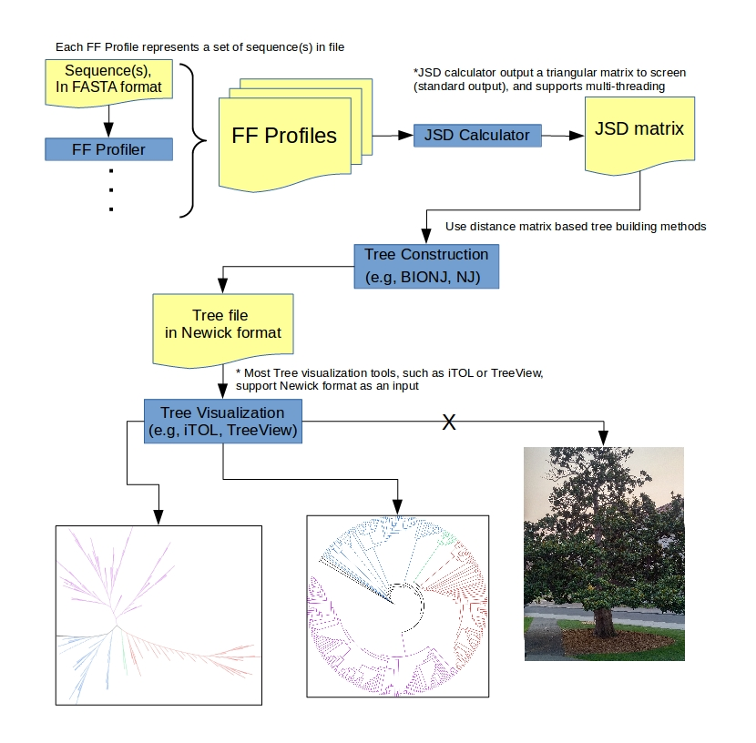

# FFP
Feature Frequency Profile (FFP); two core programs

## Requirements  
- GCC(g++) version 4.7.1+  
- Google sparse hash library. Look here: https://github.com/sparsehash/sparsehash  
- zlib version 1.2.8+. Look here: http://www.zlib.net/  

## 1. FF Profiler; FFP_compress.cpp
Compile: g++ -std=c++11 -o (execute name) (this script) -lz  
Run example: [Program path][options][input file path][output file path]  

### [Arguments]
* -h  
    Show options  
* -s [INT]  
    Feature size (l-mer)  
* -e [INT]  
    Feature size (l-mer) range end. Functional only when measuring vocabulary size using with -V  
* -a  
    Takes 20 amino acids sequences as inputs  
* -c  
    Convert and accept nucleotide bases (A, G, C, T) into RY bases (Purine, Pyrimidine)
* -k [STR]  
    Manual input of alphabet base string. For example input 'HJKL' is ['H', 'J', 'K', 'L'] bases  
* -r  
    Disable reverse complement accounting. Any bases set other than AGCT code will disable reverse complement accounting  
* -n  
    Output frequency, i.e., feature count / total feature count  
* -u  
    Accept masked (lower confidence) letters which are in lower cases in FASTA format  
* -V  
    Count vocabulary size at given range of feature length (l-mer)  
* -b [LONG LONG]  
    Bottom limit. Remove features that have the count less than [-b]  
    Default = 1
* -t [LONG LONG]  
    Top limit. Remove features that have the count larger than [-t]  
    Default = 0 = maximum  
    

### [Note]

When using option [-a], amino acids input, [-r] turns on automatically that disable reverse complement accounting, because peptide sequences are single strand that have direction (start code -> stop codon). However, nucleotide sequences input is considered as a double helix, of 'forward' and 'backward' strands, and account reverse compliment as default option.

Use [-r] option that turn off reverse compliment accounting if input is single strand nucleotide sequences such as ribosomal DNAs.  

### [Input]
FASTA format peptide or nucleotide sequence files. 

### [Output]
zlib compressed Feature Frequency Profile.

## 2. JSD Calculator; JSD_matrix.cpp
Compile: g++ -std=c++11 -pthread -o (execute name) (this script) -lz  
Run example: [Program path][options][input files path] > [output file path (standard output)]

* Input is FF Profiles of 'FFP_compress' outputs

### [Arguments]

* -h  
    Show options  
* -c [INT]  
    Specific integer code of single or escape character for delimiter in bewteen a set of [Feature|Value]  
    Default is 13, '\n', linebreak
* -t [INT]  
    Number of threads for multiprocessing  
    Heuristically, an adequate thread number is the number of cpu cores - 1. Default is 5
* -r [PATH]  
    Input previous matrix, and add more items to the matrix without calculating a whole. File name is used as an item name but no longer than 10 characters.
* -d  
    Output Jensen-Shannon distance matrix instead of Jensen-Shannon divergence matrix which is default option.  
    Square root(JS divergence) = JS distance  
    

### [Note]
[-r] input low triangular divergence or distance matrix. This requires all pair-wise output of 'FFP_compress'

### [Input]
The output files of 'FFP_compress' which are zlib compressed Feature Frequency Profiles (FFPs)

### [Output]
Standard output of low triangular Jensen-Shannon divergence or distance matrix

## Limitation
Generally, longer feature lengths (l-mer) consume more memory and time.  
In fungi proteome study the largest proteome has 35,274 proteins containing 10,866,611 amino acids, this program worked for feature length up to 24 amino acids.

## Usage / Workflow

 
  
