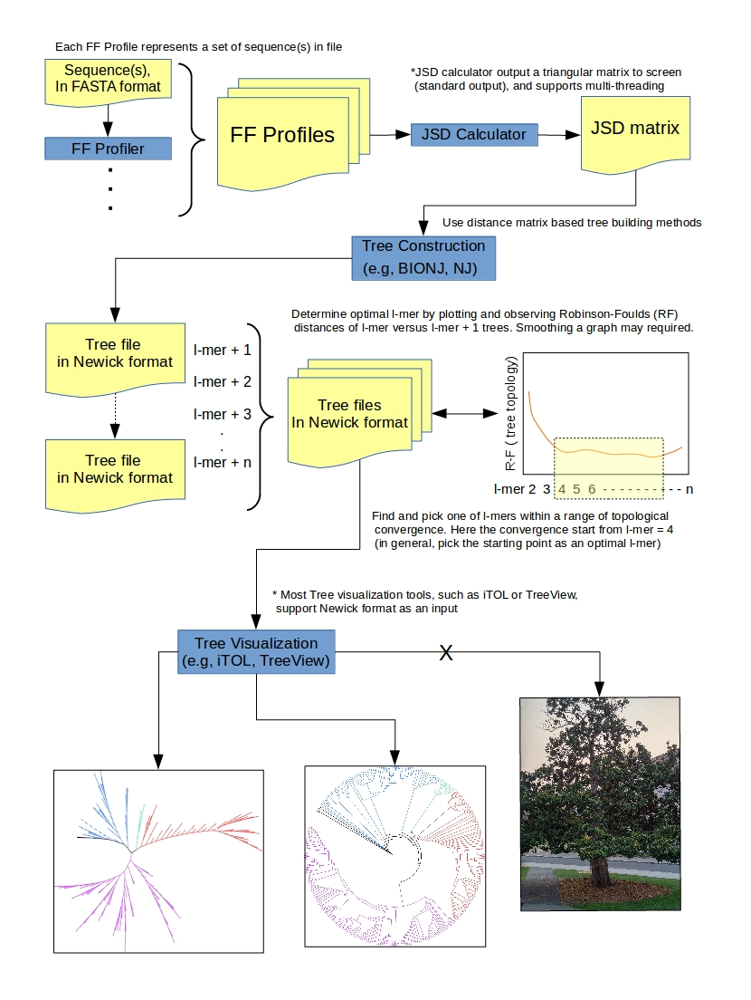

## Example; Tutorial  

### See requirements from main page  
- 14 proteome data used obtained from NCBI refseqDB which are enlisted in "16_items_list.ods" and "16_items_list.xlsx".  
- 2 randoms used as a root made by shuffling each protein sequence's order in a proteome.  

### Follow

1. Run FF Profiler. Here, using feature length [-s] 13 and "FFP_13" as a FF Profiler's output folder  
*Input is proteome: -a [input is amino acids]
*-s 13 [feature length 13]
*-n [output is 
./FFP_compress -a -s 13 -n 931890 ./FFP_13/931890  
./FFP_compress -a -s 13 -n 332648 ./FFP_13/332648  
./FFP_compress -a -s 13 -n 367775 ./FFP_13/367775  
./FFP_compress -a -s 13 -n 418459 ./FFP_13/418459  
./..  
./..  
./..  
./FFP_compress -a -s 13 -n R990650 ./FFP_13/R990650  

2. Run JSD Caculator. Here, using "16_items_13.matrix" as an output  
./JSD_maxtrix -t [number of threads] ./FFP_13/* > 16_items_13.matrix  

3. Contstruct a tree using BIONJ and the JS-Divergence matrix

