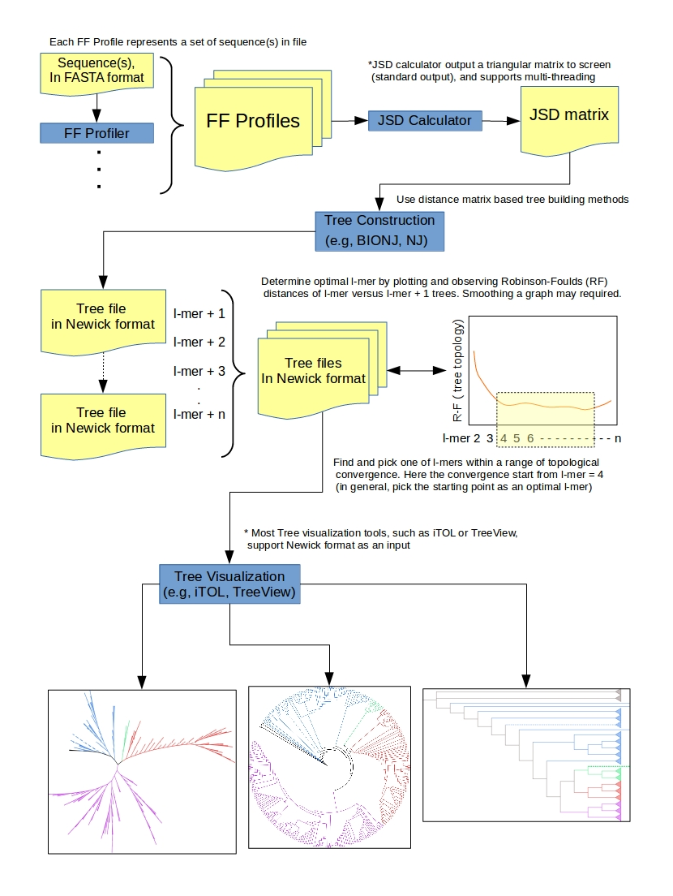

# Example / Tutorial

## Test set

* 14 proteome data used obtained from NCBI refseqDB which are enlisted in "" and ""
* 2 random proteomes generated by shuffling each protein's sequence order in proteome. The original proteomes obtained from Mycocosm DB, Joint Genome Institute (JGI)
* "" contains 5 Ascomycota, 5 Basidiomycota, 3 Protists, 1 Monokaryote, and 2 randoms

## Follow

Using the latest program version in this tutorial (see ""), under terminal environment (e.g., Linux, or Cygwin for Window).

### 1. Run FFP Profiler

* Input is proteome (amino acids), -a  
* Feature length (l-mer) is 13, -s 13  
* Normalize output (frequency), -n  
* Output folder is "./FFP_13", manually created  

```console
mkdir ./FFP_13
./FFP_bin_2v.4 -a -s 13 -n 931890 ./FFP_13/931890  
./FFP_bin_2v.4 -a -s 13 -n 332648 ./FFP_13/332648  
./FFP_bin_2v.4 -a -s 13 -n 367775 ./FFP_13/367775  
./FFP_bin_2v.4 -a -s 13 -n 418459 ./FFP_13/418459  
```

Do for each file up to ...  
./FFP_bin_2v.4 -a -s 13 -n R990650 ./FFP_13/R990650  

### 2. Run JSD Calculator

* Using 3 threads, -t 3  
* Standard output to "16_items_13.matrix"
* And output a symmatrix full square matrix [-s]. Default is lower triangular matrix.

```console
./JSD_matrix_bin_2v.4 -s -t 3 ./FFP_13/* > 16_items_13.matrix  
```

* Sample output: "" (the symmetric matrix input for BIONJ input)  

### 3. Construct a tree (newick) from the divergence matrix

* You can use either BIONJ or NJ. However, BIONJ requires to input a symmetric matrix  
* For this example, we use BIONJ provided here (http://www.atgc-montpellier.fr/bionj/) but any method that takes distance/divergence matrix works  

```console
./BIONJ 16_items_13.matrix 16_items_tree.newick  
```

* Sample output: ""  


### 4. Tree Visualization

* For this example, we use ITOL (http://itol.embl.de/)
* Sample output:   

## Workflow

* Repeat the "Follow" cycle above per feature length (l-mer) and tree  

