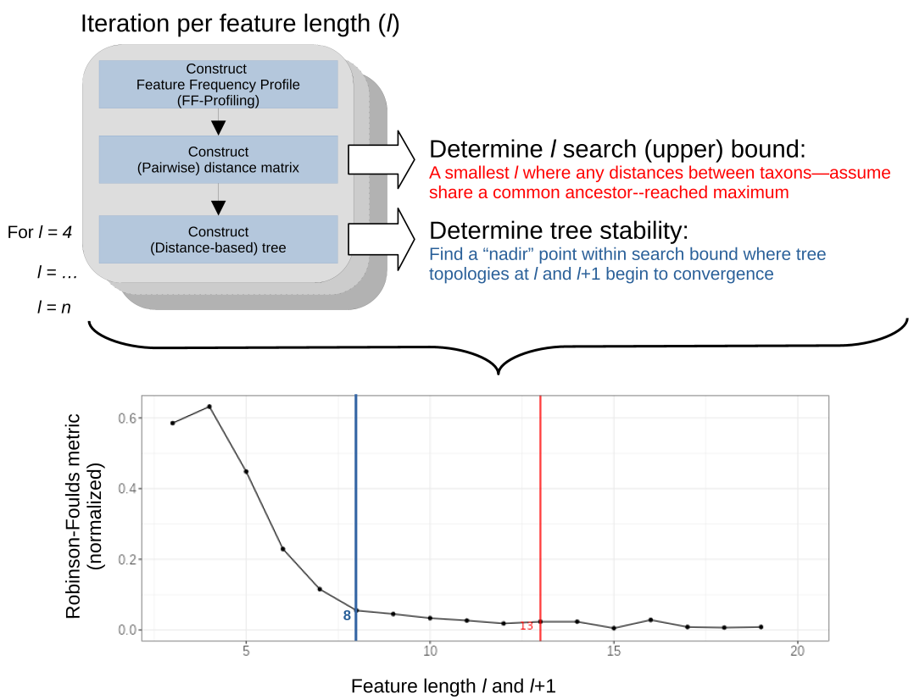

# Tutorial

## On dataset

All 600 proteome data are obtained from NCBI RefSeqDB that the corresponding whole genome assembly is categorized to either "reference genome" or "representative genome", and their assembly levels or qualities are equal or better than "scaffold".

For convenience the dataset is preprocessed and compressed in .zip file, where each proteome data is store in a FASTA file named in unique NCBI taxonID (and for tree leaf names). In addition, any organelle-derived sequences (e.g., mitochondrion or chloroplast) are removed during preprocessing.

## Logistic

For this tutorial, the version "" is used. All core programs are developed to use in a command-line environment or terminal (e.g., Linux, or Cygwin for Window). A whole steps will be done in your current working directory.

For convenience, you can run locally with a provided (Python) wrapper script to automate series of steps, including FF-Profiling, distance matrix constructing, tree building and result summarizing, Or, see two core commands to adopt in your working environment, such as cluster compute environments.

Please (click to) copy, paste, and execute code blocks in your terminal.

## Download _preprocessed_ dataset

```console {check the github file location}
wget https://raw.githubusercontent.com/jaejinchoi/FFP/refs/heads/master/example/600-proteome-in-taxid.zip
unzip 600-proteome-in-taxid.zip
```

<br>

## Two core commands

### 1. Construct Feature Frequency Profile (FFP)

* -a; input is proteome (amino acids)
* -s 8; Feature length (_l_) of 8
* -n; normalize feature counts into frequencies
* Output folder is "./ffp_8", manually created  
* Manually create output folder, "./FFP_4"

```console
mkdir ./ffp.4
./FFP_bin_2v.4 -a -s 8 -n 600-proteome-in-taxid/8407 ./ffp.8/8407
./FFP_bin_2v.4 -a -s 8 -n 600-proteome-in-taxid/373903 ./ffp.8/373903  
./FFP_bin_2v.4 -a -s 8 -n 600-proteome-in-taxid/1794699 ./ffp.8/1794699  
```

Do for each file for each feature length (_l_)...

### 2. Construct (symmetric) distance matrix, of Jensen-Shannon Divergence

* -T; using tab as a separator of taxon names and the distance values. Taxon names fixed to first 10 characters by default (trimmed if exceed).
* -t 3; using 3 threads or cores
* -s; Print full square distance matrix (lower triangular matrix by default) since some tree building programs require fully square distance matrices
* The output is printed to screen, thus, '>' captures printed results to the following file path, here, save to "matrix.fp_8"

```console
./JSD_matrix_bin_2v.4 -T -s -t 3 ./FFP_8/* > matrix.fp_8
```

Resulting matrix: ""

<hr>

<br>

## Python wrapper to automate iteration

Essentially, the wrapper script orchestrate the core comamnds to automate iteration of searching feature lengths. Please check you have already downloaded and compiled core programs in "Instruction logistic" to proceed.

### Requirements

* Python3.3+
* Pip3 # for easy Python package installation
* Dendropy
* Pandas
* matplotlib # for Pandas plot backend

```console
pip3 install dendropy pandas matplotlib
```

Once requirements are met let's create new folder for tutorial, jump in, and download the wrapper script.

```console
mkdir ./ffp_tutorial
cd ./ffp_tutorial
wget https://raw.githubusercontent.com/jaejinchoi/FFP/refs/heads/master/example/ffp_wrapper/ffp_wrapper.py
python3 ffp_wrapper.py --help
```

You should see the wrapper script's arguments/options needed and supported (--help). Move compiled core programs and unzipped dataset folder to the tutorial working folder, "./ffp_tutorial".

Now let's iterate/search feature length from 4 to 12.

* -s 4; (search) from _l_=4
* -e 12; (till) to _l_=12
* -S ./; do all works and saves in current directory
* --thread 3; using 3 threads
* --ffp_ppath ./FFP_bin_2v.4; here assumes FF-Profiling program is in current working folder
* --ffp_parg "-a -n"; arguments to pass on to FF-Profilng program located by --ffp_ppath
* --dmat_ppath ./JSD_matrix_bin_2v.4; here assumes distance calculating program is in current working folder
* --dmat_parg "-T -s"; arguments to pass on to distance calculating program located by --dmat_ppath
* --rf_norm; the option to normalize Robinson-Foulds metric (tree topology difference) when creating a plot to determine optimum feature length (_l_)

```console
python3 ./ffp_wrapper.py -s 4 -e 12 -S ./ --thread 3 --ffp_ppath ./FFP_bin_2v.4 --ffp_parg "-a -n" --dmat_ppath ./JSD_matrix_bin_2v.4 --dmat_parg "-T -s" --rf_norm 600-proteome-in-taxid/*
```

### On tree construction

Construct Neighbor-Joining (NJ) tree using Dendropy package by default, but you may want to use external tree building programs that take a distane matrix (e.g., BIONJ; <http://www.atgc-montpellier.fr/bionj/>). To do so, use --tree_ppath [path_to_program] and --tree_parg [arguments_to_pass], then, it will execute a command in this format:
> [path_to_program] [arguments_to_pass] [input_path] [output_path]

<br>

## Workflow

Search and increment _l_ until reaches to upperbound where a distane between any two taxons reached maximum (e.g., Jesen-Shannon Divergence maximum is 1.0), which assumes those taxons share a common ancestor (either in- or out-group).

If outgroup is composed of artifically generated taxons and have no _evolutionary relatationship_ to _natural_ taxons, then, all distances from outgroup to ingroup should be maximum; therefore, such a point of _l_ act as lowerbound of optiumal _l_ search

Upperbound is practically more important in defining search boundary because not all studies include artifical taxons (outgroup) for tree rooting and the fact lowerbound is hard-capped (to _l_=1).

