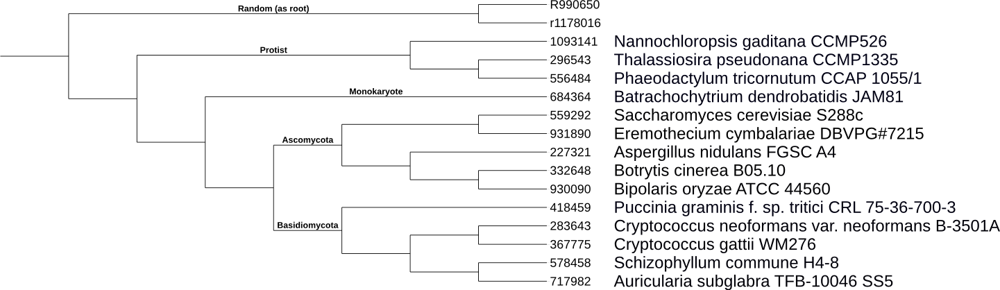

# Example; Tutorial  

## Test set  
* 14 proteome data used obtained from NCBI refseqDB which are enlisted in "16_items_list.ods" and "16_items_list.xlsx"  
* 2 random proteomes generated by shuffling each protein's sequence order in proteome. The original proteomes obtained from Mycocosm DB, Joint Genome Institute (JGI)
* "Tutorial_16_proteomes" contains 5 Ascomycota, 5 Basidiomycota, 3 Protists, 1 Monokaryote, and 2 randoms

## Follow  

### 1. Run FFP Profiler  
* Input is proteome (amino acids), -a  
* Feature length (l-mer) is 13, -s 13  
* Normalize output (frequency), -n  
* Output folder is "./FFP_13"  

./FFP_compress -a -s 13 -n 931890 ./FFP_13/931890  
./FFP_compress -a -s 13 -n 332648 ./FFP_13/332648  
./FFP_compress -a -s 13 -n 367775 ./FFP_13/367775  
./FFP_compress -a -s 13 -n 418459 ./FFP_13/418459  
./..  
./..  
./..  
./FFP_compress -a -s 13 -n R990650 ./FFP_13/R990650  

### 2. Run JSD Caculator
* Using 3 threads, -t 3  
* Standard output to "16_items_13.matrix", is asymmetric matrix  
* Use a python script, "to_symmetrix.py", provided to convert asymmetric to symmemtric matrix

./JSD_maxtrix -t 3 ./FFP_13/* > 16_items_13.matrix  

* Sample output: "16_items_13.matrix" (pre-converted to symmetic matrix for BIONJ input)  

### 3. Construct a tree (newick) from the divergence matrix 
* You can use either BIONJ or NJ. However, BIONJ requires to input a symmetric matrix  
* For this example, we use BIONJ provided here (http://www.atgc-montpellier.fr/bionj/) but any method that takes distance matrix works  

./BIONJ 16_items_13.matrix 16_items_tree.newick  

* Sample output: "16_items_tree.newick"  

### 4. Tree Visualization
* For this example, we use ITOL (http://itol.embl.de/)

